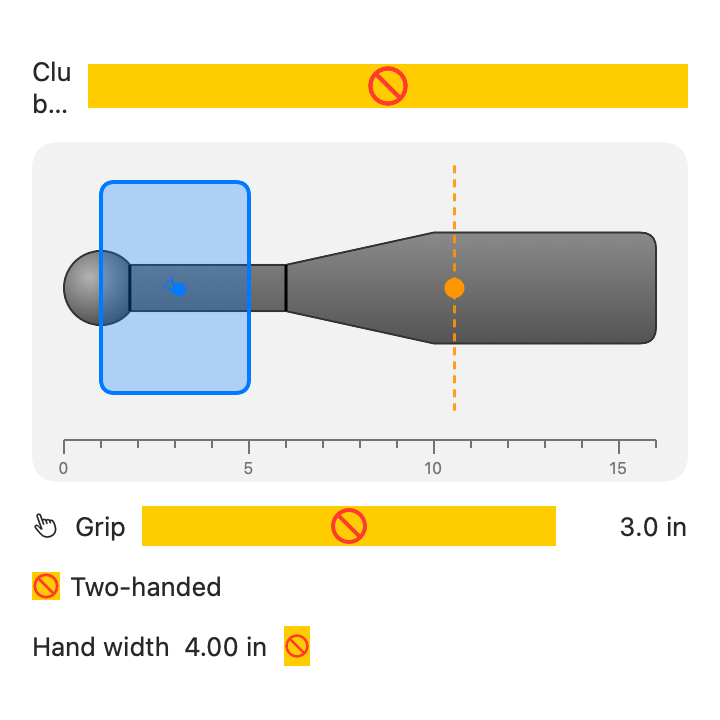
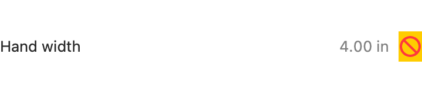
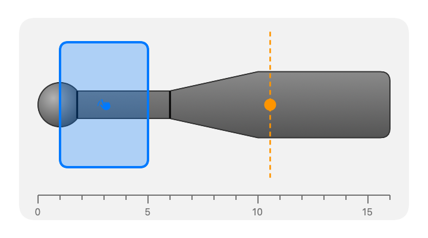
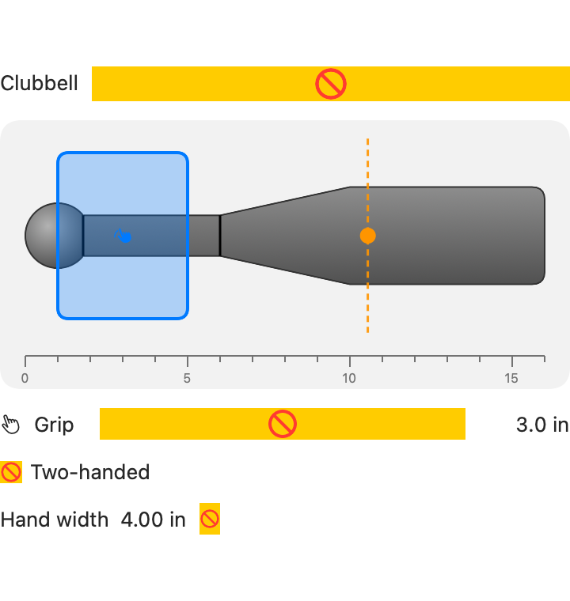

# ClubbellKit

Clubbell equipment model for set-logging apps: catalog of reference clubbells, grip
selection, and swing mechanics (torque, moment of inertia) computed from club + grip + pose.

## Components

<!-- SCREENSHOTS:START -->
| Component | Preview |
| --- | --- |
| `ClubGripSelector` |  |
| `ClubHandWidthStepper` |  |
| `ClubProfileView` |  |
| `ClubbellInputView` |  |
<!-- SCREENSHOTS:END -->

## Requirements

- iOS 17+ / macOS 14+
- Swift 5.9+

## Installation

```swift
.package(url: "https://github.com/sphericalwave/ClubbellKit.git", branch: "main")
```

## Overview

- `Clubbell` — conforms to `EquipmentModel` (from EquipmentKit)
- `ClubCatalog` — reference clubbells from `club_geometry.csv` (weight in lb, geometry in inches)
- `ClubDimensions` — a club's physical dimensions
- `ClubSelection` — the chosen clubbell + grip; `Codable`/`Hashable`, persistence-agnostic
- `ClubGripSelector` — SwiftUI grip picker
- `ClubMechanics` / `MechanicsResult` — torque and moment-of-inertia computation
- `ClubProfileView` / `ClubbellInputView` — SwiftUI views for selection and set-logging input

## Dependencies

- [EquipmentKit](https://github.com/sphericalwave/EquipmentKit) (local path dependency: `../../Logging/EquipmentKit`)
